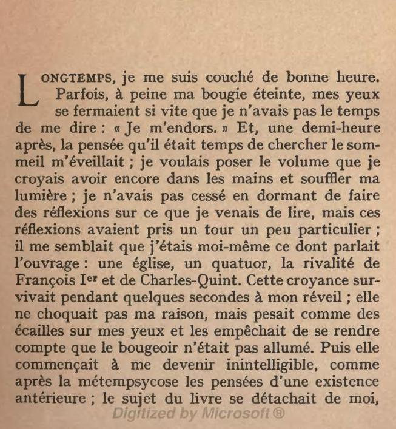
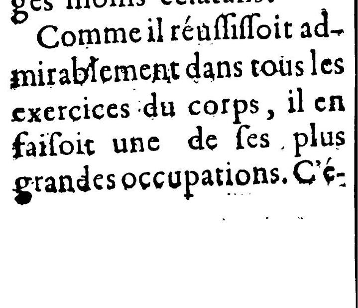
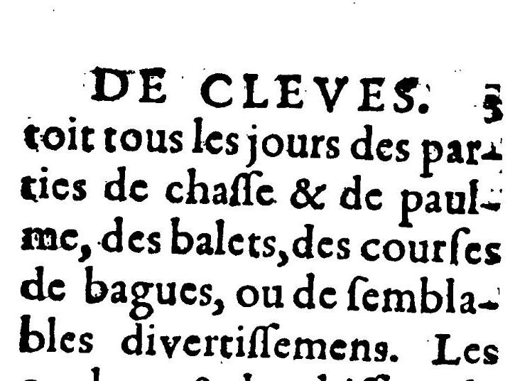
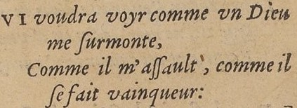
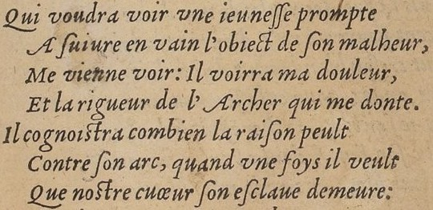

Formation Edition numérique

# TEI (1ère partie): le théâtre et le vers

Simon Gabay
Metz, Jeudi 5 mars 2020

---
# Les bases
---
## Le paragraphe

Le paragraphe s'encode avec la balise `<p>`



```XML
<p>Longtemps, je me suis couché de bonne heure. Parfois,
à peine ma bougie éteinte, mes yeux se fermaient si vite
que je n’avais pas le temps de me dire : « Je m’endors. »
Et, une demi-heure après, la pensée qu’il était temps de
chercher le sommeil m’éveillait ; je voulais […]</p>
```
---
## La page

Pour encoder le changement de page, on utilise la balise `<pb/>`. Remarquons que cette balise est auto-fermante, pour éviter les chevauchements



```XML
Comme il réuſſiſſoit admirablement dans tous les
exercices du corps, il en faiſoit une de ſes plus grandes
occupations. C’é-<pb/>toit tous les jours des parties
de chaſſe &amp; de paulme, des balets, des courſes de
bagues, ou de ſemblables divertiſſemens.
```
---
## La structure en `<div>`

On regroupe du texte, peu importe pour quelle raison, avec la balise `<div>`. Ainsi la structure suivante:

```YAML
livre:
  -préface
  -introduction
  -chapitre 1
  -chapitre 2
  -postface
```

Est encodée ainsi:

```XML
<div>
  <div>préface</div>
  <div>introduction</div>
  <div>chapitre 1</div>
  <div>chapitre 2</div>
  <div>postface</div>
</div>
```

---

On intègre les paragraphes à l'intérieur des `>div>`

```XML
<div>
  <div>préface</div>
  <div>introduction</div>
  <div>chapitre 1</div>
  <div>chapitre 2</div>
  <div>postface</div>
</div>
```
---

```YAML
livre:
  -partie 1
    chapitre 1
    chapitre 2
    chapitre 3
  -partie 2
    chapitre 1
    chapitre 2
    chapitre 3
```

```YAML
recueil:
  -poème 1
  -poème 2
  -poème 3
```

```YAML
pièce:
  -acte 1
    scène 1
    scène 2
  -acte 2
    scène 1
    scène 2
```

---
On reproduit cette logique pour tous les types:

```XML
<div>
  <div>
    <head>préface</head>
    <p>…</p>
     <p>…</p>
  </div>
  <div>
    <head>introduction</head>
     <p>…</p>
     <p>…</p>
  </div>
  <div>
    <head>chapitre 1</head>
     <p>…</p>
     <p>…</p>
     <p>…</p>
  </div>
  <div>
    <head>chapitre 2</head>
     <p>…</p>
     <p>…</p>
  </div>
</div>
```

---
# Le vers
---
## Le vers
Il ne faut pas confondre un vers (`<l>`) avec un retour à la ligne (`<lb/>`)




```XML
<l>QVI voudra voyr comme vn Dieu
  <lb/> me ſurmonte,</l>
<l>Comme il m'aſſault, comme il
  <lb/>ſe fait vainqueur:</l>
```

---
## La strophe

On encode les strophes avec `<lb>`. Regardez les @attributs.



```XML
<lg n="1" type="quatrain">
  <l n="1">Qui voudra voir une ieuneſſe prompte</l>
  <l n="2">A ſuivre en vain l'obiect de ſon malheur,</l>
  <l n="3">Me vienne voir: Il voirra ma douleur,</l>
  <l n="4">Et la rigueur de l'Archer qui me donte.</l>
</lg>
<lg n="2" type="tercet">
  <l n="5">Il cognoistra combien la raiſon peult</l>
  <l n="6">Contre ſon arc, quand vne fois il veult</l>
  <l n="7">Que nostre cuœur ſon eſclaue demeure:</l>
</lg>
```
---
## Le mot

On peut aussi encoder au niveau du mot avec `<w>`, par exemple pour la ryhme:

```XML
<l>QVI voudra voyr comme vn Dieu
  <lb/> me <w rhyme="a">ſurmonte</w>,</l>
<l>Comme il m'aſſault, comme il
  <lb/>ſe fait <w rhyme="b">vainqueur</w>:</l>
```
Notons que, en TEI, il existe plusieurs manières de faire la même chose:

```XML
<lg ryhme="ab">
  <l>QVI voudra voyr comme vn Dieu
    <lb/> me <rhyme label="a">ſurmonte</rhyme>,</l>
  <l>Comme il m'aſſault, comme il
    <lb/>ſe fait <rhyme label="b">vainqueur</rhyme>:</l>
</lg>
```

---
# Le théâtre
---

