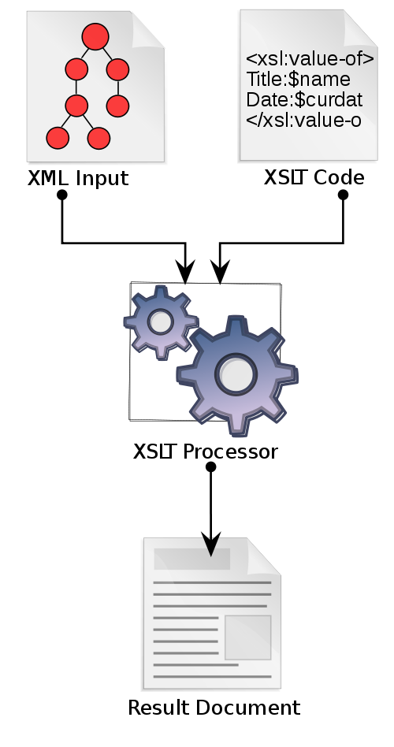

Formation Edition numérique

# TEI (5ème partie): du XML au HTML

Simon Gabay
Metz, Vendredi 6 mars 2020

---
## XSLT

---
### XSLT

XSLT (eXtensible Stylesheet Language Transformations) est un  langage de transformation XML de type fonctionnel. Il permet de modifier un document XML ou de le transformer en un autre document (CSV, HTML, LaTeX…).

Plus d'informations sur [Wikipedia](https://fr.wikipedia.org/wiki/Extensible_Stylesheet_Language_Transformations)

---
### La transformation



Source: [Wikipedia](https://commons.wikimedia.org/wiki/File:XSLT_en.svg)

---
### Une feuille de style XSLT minimale

```XML
<?xml version="1.0" encoding="UTF-8"?>
<xsl:stylesheet
    xmlns:xsl="http://www.w3.org/1999/XSL/Transform"
    xmlns:xs="http://www.w3.org/2001/XMLSchema"
    exclude-result-prefixes="xs"
    version="2.0">

</xsl:stylesheet>
```

Deux remarques:
1. C'est un langage qui s'écrit en XML (on reconnait les chevrons, les éléments, les attributs…)
2. Il existe plusieurs versions (1, 2 et 3) qui sont légèrement différentes. Il faut donc choisir le bon processeur XSLT (cf. image _supra_ pour la bonne version).

---
### XML et espace de nom

Dans un document XML-TEI, nous avons vu qu'il y a le langage d'une part (XML) et le vocabulaire d'une autre (TEI). Il faudrait donc préciser que les éléments XML utilisés relèvent de cet _espace  de nom_ à chaque fois au moyen d'un préfixe

```XML
<tei:TEI xmlns:tei="http://www.tei-c.org/ns/1.0">
  <tei:teiHeader>
     <tei:fileDesc>
         <tei:titleStmt>
            <tei:title>…
```

Il est possible de faire l'économie de cette précision en déclarant une seule fois l'espace de nom sur l'élément racine:

```XML
<TEI xmlns="http://www.tei-c.org/ns/1.0">
  <teiHeader>
      <fileDesc>
         <titleStmt>
            <title>…
```
---

### XSLT et espace de nom

```XML
<?xml version="1.0" encoding="UTF-8"?>
<xsl:stylesheet
   xmlns:xsl="http://www.w3.org/1999/XSL/Transform"
   xmlns:xs="http://www.w3.org/2001/XMLSchema"
   exclude-result-prefixes="xs"
   version="2.0">

</xsl:stylesheet>
```

Comme sur le document XML, il faut donc préciser l'espace de nom par défaut pour la feuille XSL, car il y en a un autre: ```xsl:```.

```XML
<?xml version="1.0" encoding="UTF-8"?>
<xsl:stylesheet
   xmlns:xsl="http://www.w3.org/1999/XSL/Transform"
   xmlns:xs="http://www.w3.org/2001/XMLSchema"
   exclude-result-prefixes="xs"
   version="2.0"
   xpath-default-namespace="http://www.tei-c.org/ns/1.0">

</xsl:stylesheet>
```
---

### XSLT: principe de base

Une feuille XSLT ne modifie pas un fichier: il retire toutes les balises. Si l'on veut garder ou modifier un élément, il faut ajouter une règle. Pour ce faire, on utilise l'élément ```xsl:template```:

```XML
<xsl:template match="unElement">
  <xsl:apply-templates/>
</xsl:template>
```

Pour "copier-coller" l'élément ```<head>``` de cet exemple

```XML
<head>Sonetz</head>
```

il faut le remettre:

```XML
<xsl:template match="head">
  <head><xsl:apply-templates/></head>
</xsl:template>
```

---

### Une première modification

Pour changer l'élément ```<head>``` en élément ```<h1>```:

```XML
<head>Sonetz</head>
```

il faut appliquer la règle suivante:

```XML
<xsl:template match="head">
  <h1><xsl:apply-templates/></h1>
</xsl:template>
```
On traduit ainsi le document XML en HTML:

```HTML
<h1>Sonetz</h1>
```

---

### Enchaîner les règles

Il faut donc appliquer une règle par élément que l'on veut modifier:

```XML
<xsl:template match="div">
  <div>
    <xsl:apply-templates/>
  </div>
</xsl:template>

<xsl:template match="head">
  <h1>
    <xsl:apply-templates/>
  </h1>
</xsl:template>

<xsl:template match="p">
  <p>
    <xsl:apply-templates/>
  </p>
</xsl:template>
```

---

### Ordre

L'ordre de la feuille de style importe peu: ce qui compte est l'ordre du document XML.

```
<div>
    <head>Titre</head>
    <p>Un paragraphe</p>
    <p>Un autre paragraphe</p>
</div>
````

Ce document XML peut être traité par la série de règles suivante:


```XML
<xsl:template match="p">
  <p><xsl:apply-templates/></p>
</xsl:template>

<xsl:template match="head">
  <h1><xsl:apply-templates/></h1>
</xsl:template>

<xsl:template match="div">
  <div><xsl:apply-templates/></div>
</xsl:template>
```

---

### Une page HTML incomplète

Rappelons qu'une page HTML minimale est la suivante:

```HTML
<!DOCTYPE html>
<html>
    <head>
        <title></title>
    </head>
    <body>mon texte</body>
</html>
```

Notre résultat obtenu ne suffit pas: nous n'avons construit que l'intérieur du ```<body>```:
```
<div>
    <head>Titre</head>
    <p>Un paragraphe</p>
    <p>Un autre paragraphe</p>
</div>
```
---

### Une page HTML complète

Ces informations doivent entourer l'élément racine, que l'on désigne de manière conventionnelle avec un slash (```/```):

```XML
<xsl:template match="/">
  <html>
    <head>
      <title>Exercice XSLT</title>
    </head>
    <body>
      <xsl:apply-templates/>
    </body>
  </html>
</xsl:template>
```

---

### Une transformation XML-TEI -> HTML minimale

Pour modifier un document XML-TEI avec uniquement une ```<div>```:

```XML
<?xml version="1.0" encoding="UTF-8"?>
<xsl:stylesheet
   xmlns:xsl="http://www.w3.org/1999/XSL/Transform"
   xmlns:xs="http://www.w3.org/2001/XMLSchema"
   exclude-result-prefixes="xs" version="2.0"
   xpath-default-namespace="http://www.tei-c.org/ns/1.0">

  <xsl:template match="/">
    <html>
      <head>
        <title>Exercice XSLT</title>
      </head>
      <body><xsl:apply-templates/></body>
    </html>
  </xsl:template>

  <xsl:template match="div">
    <div><xsl:apply-templates/></div>
  </xsl:template>

</xsl:stylesheet>
```

---
## XPath

---

### Précision

Dans la règle que nous avons mentionné au tout début, il convient de corriger une approximation

```XML
<xsl:template match="unElement">
  <xsl:apply-templates/>
</xsl:template>
```

Dans cet exemple ```unElement``` n'est pas exactement le nom d'un élément, mais une fonction XPath.

---

### XPath

XPath est un langage de requête pour localiser une portion d'un document XML.

Plus d'informations sur [Wikipedia](https://fr.wikipedia.org/wiki/XPath)

---

### Principe de base

Dans le document suivant, chaque élément, chaque élément est accessible par un chemin (en anglais _path_, d'où _XPath_):

```XML
<a>
  <b>
    <c>bla bla bla</c>
    <c>ta ta ta</c>
  </b>
  <d>gna gna gna</d>
</a>
```
Pour ```<d>```, le chemin est le suivant:

```console
/a/d
```

Pour les deux ```<c>```, le chemin est le suivant:

```console
/a/b/c
```

On reconnait le ```/``` que nous avions vu précédemment

---

### Dans Oxygen

On peut faire des requêtes XPath à deux endroits dans Oxygen:


---

### Principes avancés: ```//```

Il est possible de faire un raccourci:

```console
/a/b/c
```

Peut s'écrire:

```console
//c
```

Attention cependant: dans ce cas on récupère tous les éléments ```<c>```. Le résultat de nos deux requêtes XPath est donc différent pour le document XML suivant:

```XML
<a>
  <b>
    <c>bla bla bla</c>
    <c>ta ta ta</c>
  </b>
  <c>gna gna gna</c>
</a>
```

---

### Principes avancés: les prédicats

Il est possible de préciser notre chemin avec des prédicats. Prenons le document suivant:

```XML
<a>
  <b>
    <c type="bla">bla bla bla</c>
    <c type="ta">ta ta ta</c>
  </b>
  <c>gna gna gna</c>
</a>
```

Il est possible de dire que l'on veut le premier ```<c>``` uniquement:

```console
/a/b/c[1]
```

Ou que l'on veut un élément avec un attribut précis (attention aux guillemets simples:

```console
/a/b/c[type='bla']
```

---

### La famille xml

On décrit souvent le XML sur un mode généalogique (on parle "d'axe"):

```XML
<a>
  <b>
    <c type="bla">bla bla bla</c>
    <c type="ta">ta ta ta</c>
  </b>
  <c>gna gna gna</c>
</a>
```

Dans ce cas:

1. ```<b>``` est le parent (_parent_) de ```<c>```
2. ```<b>``` est l'enfant (_child_) de ```<a>```
3. ```<c>``` est le descendant (_descendant_) de ```<a>```
4. ```<a>``` est l'ancêtre (_ancestor_) de ```<c>```

---

### Principes avancés: les axes

Il est possible d'utiliser ces informations généalogiques pour localiser des éléments précis:

```XML
<a>
  <b>
    <c>bla bla bla</c>
    <c>ta ta ta</c>
  </b>
  <c>gna gna gna</c>
</a>
```

```console
//c[parent::a]
```

est l'équivalent de

```console
/a/c
```

On peut combiner les prédicats:

```console
//c[parent::b][1]
```
